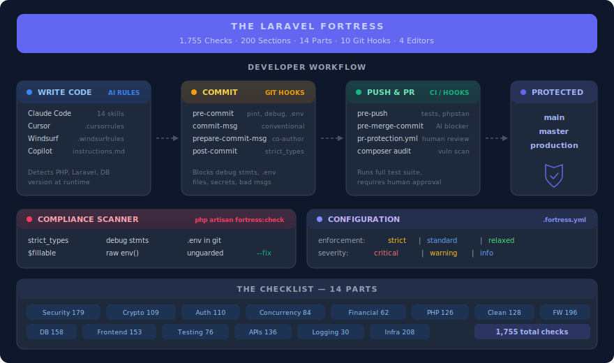

# The Laravel Fortress

[](LICENSE)
[](CONTRIBUTING.md)
[](#the-checklist)

**1,755 engineering checks for building Laravel applications that are secure, correct, auditable, and maintainable.**

Born from repeated production audits of a financial platform. Expanded into a universal standard for any Laravel project.

<p align="center">
  
</p>

## Installation

```bash
composer require --dev chuxolab/laravel-fortress
```

Then run the interactive installer:

```bash
php artisan fortress:install
```

This walks you through setting up:

- **AI rules** for your editor (Claude Code, Cursor, Windsurf, Copilot — auto-detected)
- **Git hooks** — 10 safety hooks for catching debug statements, formatting issues, secret leaks, and AI auto-merge
- **CI workflow** — GitHub Actions PR protection template
- **Config** — `.fortress.yml` for per-project rule tuning

You can also install components individually:

```bash
php artisan fortress:install --hooks      # Git hooks only
php artisan fortress:install --rules      # AI rules only
php artisan fortress:install --ci         # CI workflow only
php artisan fortress:install --all        # Everything, no prompts
```

### Non-Laravel PHP projects

```bash
curl -sL https://raw.githubusercontent.com/oilmonegov/laravel-fortress/main/install.sh | bash
```

---

## What You Get

### 1. The Checklist — 1,755 checks across 14 parts

A comprehensive engineering reference. Every check is a `- [ ]` item you can tick off during code review, sprint planning, onboarding, or audit prep.

| Part | Focus | Checks | File |
|:----:|-------|:------:|------|
| I | Application Security | 179 | [`01-application-security.md`](parts/01-application-security.md) |
| II | Cryptography & Data Protection | 109 | [`02-cryptography-data-protection.md`](parts/02-cryptography-data-protection.md) |
| III | Authentication & Authorization | 110 | [`03-authentication-authorization.md`](parts/03-authentication-authorization.md) |
| IV | Data Integrity & Concurrency | 84 | [`04-data-integrity-concurrency.md`](parts/04-data-integrity-concurrency.md) |
| V | Financial & Monetary Correctness | 62 | [`05-financial-monetary-correctness.md`](parts/05-financial-monetary-correctness.md) |
| VI | PHP Language & Type Safety | 126 | [`06-php-language-type-safety.md`](parts/06-php-language-type-safety.md) |
| VII | Clean Code & Software Design | 128 | [`07-clean-code-software-design.md`](parts/07-clean-code-software-design.md) |
| VIII | Laravel Framework Mastery | 196 | [`08-laravel-framework-mastery.md`](parts/08-laravel-framework-mastery.md) |
| IX | Database Engineering | 158 | [`09-database-engineering.md`](parts/09-database-engineering.md) |
| X | Frontend Engineering | 153 | [`10-frontend-engineering.md`](parts/10-frontend-engineering.md) |
| XI | Testing & Quality Assurance | 76 | [`11-testing-quality-assurance.md`](parts/11-testing-quality-assurance.md) |
| XII | APIs, Queues & Integration | 136 | [`12-apis-queues-integration.md`](parts/12-apis-queues-integration.md) |
| XIII | Logging, Monitoring & Audit | 30 | [`13-logging-monitoring-audit.md`](parts/13-logging-monitoring-audit.md) |
| XIV | Infrastructure & Operations | 208 | [`14-infrastructure-operations.md`](parts/14-infrastructure-operations.md) |

Read the full list in one file: [`checklist.md`](checklist.md)

### 2. AI Rules — Your editor enforces the checks automatically

The AI skill system teaches your coding assistant all 1,755 checks. It adapts to your project's PHP version, Laravel version, database, and installed packages at runtime.

| Editor | What Gets Installed | How It Works |
|--------|-------------------|--------------|
| **Claude Code** | 14 modular skills + `CLAUDE.md` | Deepest integration — skills activate per domain, works with `feature-dev` and Laravel Boost |
| **Cursor** | `.cursorrules` | Inline review, Composer mode, MCP support |
| **Windsurf** | `.windsurfrules` | Cascade flows, multi-step generation |
| **GitHub Copilot** | `.github/copilot-instructions.md` | Chat, PR review, inline suggestions |

### 3. Git Hooks — Safety rails for AI-assisted development

AI agents write code fast. These hooks catch mistakes at the git level before they reach your repository.

| Hook | What It Does |
|------|-------------|
| **pre-commit** | Blocks debug statements (`dd`, `dump`, `ray`), `.env` files, hardcoded secrets, Pint violations |
| **commit-msg** | Enforces conventional commits, length limits, blocks WIP on protected branches |
| **pre-push** | Runs tests, PHPStan, `composer audit` — blocks direct push to `main`/`master`/`production` |
| **pre-merge-commit** | Detects AI agents and blocks auto-merge to protected branches |
| **prepare-commit-msg** | Auto-adds `Co-Authored-By` tag when AI context detected |
| **post-checkout** | Warns when `composer.lock` or JS lock files changed between branches |
| **post-merge** | Same as post-checkout, plus detects migration changes |
| **pre-rebase** | Blocks rebase of protected branches |
| **post-commit** | Advisory: warns about missing `strict_types`, counts TODOs |
| **applypatch-msg** | Validates commit messages from `git am` patches |

Plus **5 stub hooks** (server-side templates) installable with `--with-stubs`. See [`hooks/README.md`](hooks/README.md).

### 4. Compliance Scanner

```bash
php artisan fortress:check
```

Scans your codebase for common violations:

| Check | Rule ID | What It Finds |
|-------|---------|---------------|
| `strict_types` | F-P06-001 | PHP files missing `declare(strict_types=1)` |
| Debug statements | F-P07-012 | `dd()`, `dump()`, `ray()`, `var_dump()` |
| `.env` in git | F-P01-015 | Environment files tracked in version control |
| Missing `$fillable` | F-P08-003 | Models without mass assignment protection |
| Raw `env()` calls | F-P08-041 | `env()` used outside `config/` files |
| Unguarded models | F-P01-010 | `Model::unguard()` calls |

Auto-fix what's fixable:

```bash
php artisan fortress:check --fix
```

### 5. PR Merge Protection

A GitHub Actions workflow template that:

- Runs Pint, PHPStan, tests, and `composer audit` on every PR
- Requires human approval before merge (blocks bot/AI auto-merge)
- Verifies review count meets minimum threshold

Installed to `.github/workflows/fortress-pr-protection.yml` — configure branch protection rules on GitHub to require these checks.

---

## Configuration

After installation, edit `.fortress.yml` in your project root:

```yaml
fortress:
  version: "1.1.0"

  # Enable/disable parts and set enforcement levels
  parts:
    P01_application_security:
      enabled: true
      enforcement: strict        # strict | standard | relaxed

    P05_financial_monetary:
      enabled: true
      enforcement: strict        # Critical for fintech apps

    P10_frontend:
      enabled: false             # Disable for API-only projects

  # Override specific rules
  # rules:
  #   F-P08-042:
  #     enabled: false
  #     reason: "We use a custom ORM"

  minimum_severity: warning      # critical | warning | info

  # Git hooks — all enabled by default, opt-out per hook
  git_hooks:
    enabled: true
    pre_commit:
      run_pint: true
      check_debug: true
      check_secrets: true
      max_file_size_kb: 500
    pre_push:
      run_tests: true
      run_phpstan: true
      block_direct_push: true

  # AI merge protection — strongly recommended
  merge_protection:
    block_ai_auto_merge: true
    protected_branches: [main, master, production]
```

Full template: [`rules/.fortress.example.yml`](rules/.fortress.example.yml)

---

## Artisan Commands

| Command | Purpose |
|---------|---------|
| `fortress:install` | Interactive installer — select components to install |
| `fortress:install --all` | Install everything without prompts |
| `fortress:hooks install` | Install git hooks |
| `fortress:hooks install --select` | Choose which hooks to install interactively |
| `fortress:hooks install --with-stubs` | Include server-side stub hooks |
| `fortress:hooks list` | Show installed fortress hooks |
| `fortress:hooks uninstall` | Remove fortress hooks, restore backups |
| `fortress:hooks update` | Re-copy hooks after `composer update` |
| `fortress:check` | Run compliance scan |
| `fortress:check --fix` | Auto-fix issues where possible |
| `fortress:check --select` | Choose which check to run |
| `fortress:check --part=P01` | Scan a specific part |

---

## Using the Fortress

### During Code Review

1. Map the PR's changed files to fortress Parts (controllers → P01/P03/P08, models → P09, money logic → P05)
2. Ask your AI assistant: *"Review this PR against fortress Parts P01 and P08. Flag violations with rule IDs."*
3. Reference findings as `[F-P01-003]` in PR comments — traceable and searchable

### During Sprint Planning

Scan the relevant Parts before scoping a feature. Identify security, correctness, and testing requirements upfront — not as afterthoughts.

### For Onboarding

Give new team members Parts VI–VIII (PHP, Clean Code, Laravel Mastery) as required reading. Faster than explaining conventions one PR at a time.

### As an Audit Checklist

Walk through the full checklist systematically when preparing for a security audit, compliance review, or SOC 2 / ISO 27001 assessment.

### With Laravel Boost (recommended)

[Laravel Boost](https://github.com/laravel/boost) gives your AI agent direct access to your running app — database schema, routes, config, logs, Artisan commands, and Tinker. This transforms fortress enforcement from static code reading to **live application verification**.

```bash
composer require laravel/boost --dev
```

With Boost installed, your AI agent can verify fortress rules against your actual database schema, route list, config values, and application state. See [`rules/README.md`](rules/README.md) for the full tool-to-fortress mapping.

---

## Scope

Laravel 9–12 · PHP 8.1–8.4 · MySQL / PostgreSQL · Vue / React / Blade · Tailwind CSS · Redis · Pest / PHPUnit

The AI skill system is **version-agnostic** — it detects your project's actual versions and applies only the relevant rules. A PHP 8.1 project won't be told to use PHP 8.4 features.

## Not a Style Guide

This does not prescribe tabs vs spaces or where to put braces. It prescribes **engineering discipline**: how to handle money without rounding errors, how to prevent race conditions on financial records, how to structure authentication so privilege escalation is impossible, how to design migrations that don't cause downtime.

Style is preference. Discipline is survival.

## Contributing

Contributions welcome. See [CONTRIBUTING.md](CONTRIBUTING.md).

The bar: **"Would this have prevented a real bug, security vulnerability, or production incident?"** If yes, it belongs. If it's preference, it doesn't.

## License

[MIT](LICENSE)

---

Built with hard-won lessons from production. Maintained by the community.
